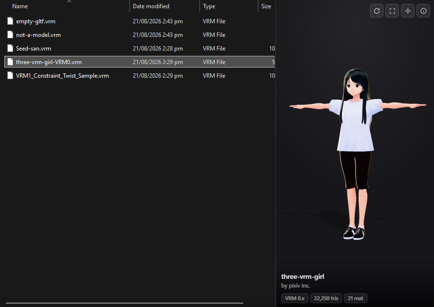

# VrmPeek

A Windows Explorer **preview handler** for `.vrm` avatar files. Select a `.vrm`
and the preview pane renders the actual model in 3D — orbit it with the mouse and
read its name, author, licence terms and mesh statistics without opening anything.



Handles **VRM 0.x** and **VRM 1.0**, including MToon materials, spring bones, and
Draco / KTX2 / meshopt compressed models.

---

## Requirements

| | |
|---|---|
| Windows | 10 1809+ / 11, x64 |
| Runtime | [WebView2 Runtime](https://developer.microsoft.com/microsoft-edge/webview2/) — preinstalled on Windows 11 |
| To build | Visual Studio 2022 Build Tools (C++ workload) + Windows SDK, and Node.js 18+ |

Installing is **per-user and needs no administrator rights** — it writes only to
`HKEY_CURRENT_USER`.

## Install

```bash
powershell -ExecutionPolicy Bypass -File scripts\fetch-deps.ps1
```

```bash
powershell -ExecutionPolicy Bypass -File scripts\build.ps1
```

```bash
powershell -ExecutionPolicy Bypass -File scripts\install.ps1
```

Then in Explorer turn the preview pane on (**View → Show → Preview pane**, or
`Alt+P`) and click a `.vrm` file.

> The DLL is registered **where it sits**. Don't move `dist\VrmPeek` after
> installing — run `uninstall.ps1` first, move it, then install again.
>
> Explorer caches its preview host per folder window. After installing or
> reinstalling, close and reopen any folder window that was already open.

To remove every registry key it created:

```bash
powershell -ExecutionPolicy Bypass -File scripts\uninstall.ps1
```

`install.ps1 -AllUsers` registers machine-wide instead (needs an elevated shell).

## Using the preview

The model faces front and turns through one slow revolution when it loads, then
settles. Four buttons appear in the top-right corner on hover:

| | |
|---|---|
| **Auto-rotate** | free turntable, on/off |
| **Framing** | cycles full body → upper body → face |
| **Reset view** | back to the default camera |
| **Details** | full metadata panel — licence, permissions, mesh counts |

Drag to orbit, scroll to zoom, right-drag to pan. Licence links in the details
panel open in your normal browser, never in the pane.

---

## How it works

```
Explorer  ──IPreviewHandler──▶  prevhost.exe (LOW integrity)
                                 └─ VrmPeek.dll
                                      ├─ child HWND in Explorer's pane
                                      └─ WebView2
                                           └─ web/viewer.html
                                                three.js + @pixiv/three-vrm
```

The native DLL is a COM in-process server implementing `IPreviewHandler`,
`IPreviewHandlerVisuals`, `IObjectWithSite`, `IOleWindow` and all three
`IInitializeWith*` interfaces. Explorer loads it into `prevhost.exe`, hands it a
window to draw in, and supplies the file — usually as an `IStream`.

The handler creates a WebView2 in that window and serves two virtual hosts to it:

- `https://vrmpeek.invalid/` → the `web` folder next to the DLL (the viewer).
- `https://model.vrmpeek.invalid/__model__.vrm` → intercepted in
  `WebResourceRequested` and answered from the file, so the model bytes never
  touch disk or the network.

Both hostnames use the reserved `.invalid` TLD, so a broken mapping fails closed
instead of reaching DNS. Navigation away from `vrmpeek.invalid` is blocked, so
nothing inside a model file can redirect the pane.

### Three things worth knowing if you touch this code

**`prevhost.exe` runs at low integrity.** It cannot write to `%LOCALAPPDATA%`, so
WebView2's user data folder lives in `%USERPROFILE%\AppData\LocalLow\VrmPeek`.
Point it anywhere else and `CreateCoreWebView2EnvironmentWithOptions` fails and
the pane stays silently blank.

**The shell's `IStream` does not implement `CopyTo`** — it returns `E_NOTIMPL`.
The handler copies the file into a memory stream with an explicit `Read`/`Write`
loop instead.

**The surrogate `AppID` for a 64-bit handler is
`{6d2b5079-2f0b-48dd-ab7f-97cec514d30b}`.** The frequently-quoted
`{534A1E02-D58F-44f0-B58B-36CBED287C7C}` is the **32-bit** host and will not load
an x64 DLL.

One more thing that surprises people: Explorer calls `SetWindow` with a **zero
rect** and only sends the real size later via `SetRect`, so the handler must
resize on `SetRect` rather than assuming the initial rect is usable.

---

## Layout

```
src/native/          C++ COM preview handler
  PreviewHandler.*     the handler itself
  dllmain.cpp          class factory, exports, self-registration
  tools/PreviewTest.cpp   stand-alone host for testing outside Explorer
src/web/             viewer sources (three.js + @pixiv/three-vrm, bundled by esbuild)
scripts/             fetch-deps / fetch-samples / build / install / uninstall
samples/             two deliberately malformed test fixtures
dist/VrmPeek/        build output: the DLL plus its web folder
```

## Development

```bash
powershell -ExecutionPolicy Bypass -File scripts\fetch-samples.ps1
```

downloads three real avatars (VRM 0.x and 1.0) to test against. They are
third-party models and are not committed here.

```bash
powershell -ExecutionPolicy Bypass -File scripts\build.ps1 -Tools
```

`-Tools` also builds `build\PreviewTest.exe`, which drives the handler exactly the
way Explorer does — through `CLSCTX_LOCAL_SERVER` and the `prevhost.exe`
surrogate — but in a plain window you can watch and debug:

```bash
build\PreviewTest.exe samples\Seed-san.vrm
```

Add `-inproc` to load the DLL into the test process instead of the surrogate,
`-light` to force the light palette.

The viewer alone can be run in any browser, which is much faster to iterate on:

```bash
node scripts\devserver.mjs
```

then open `http://localhost:8777/viewer.html?model=/samples/Seed-san.vrm`.

Other flags: `build.ps1 -SkipWeb` skips the JS bundle, `-Configuration Debug`
builds unoptimised with symbols.

> `build.ps1` kills `prevhost.exe` before linking, because a live preview keeps
> the DLL open. Folder windows that were open at that moment hold a stale preview
> host and will fail with `ERROR_INVALID_WINDOW_HANDLE` until reopened — close and
> reopen them after a rebuild.

## Troubleshooting

**The pane is blank.** Turn on tracing and read the log:

```bash
powershell -ExecutionPolicy Bypass -File scripts\install.ps1 -EnableLogging
```

Every step is written to `%USERPROFILE%\AppData\LocalLow\VrmPeek\vrmpeek.log` —
initialisation, window creation, WebView2 environment and controller HRESULTs,
navigation result, and the size served for the model. Re-run `install.ps1`
without the switch to turn it off again.

**"This file can't be previewed."** Explorer could not create the handler. Check
that the DLL is still at the registered path:

```bash
reg query "HKCU\Software\Classes\CLSID\{EE2F8D4B-40E1-486F-B8DF-A51B16899142}\InprocServer32"
```

**Nothing changed after reinstalling.** Close and reopen the folder window.

**"Not a VRM file" / "Nothing to preview".** The file is not glTF binary, or it
parses but has no meshes. `samples\not-a-model.vrm` and `samples\empty-gltf.vrm`
exercise both paths on purpose.

## Limits

- x64 only. A 32-bit Explorer would need a separate build registered under the
  32-bit surrogate `AppID`.
- Renders the model in its bind pose; no animation playback.
- Provides the preview pane only — Explorer *thumbnails* for `.vrm` would need an
  `IThumbnailProvider`, which this does not implement.

## Licence

MIT — see [LICENSE](LICENSE).

[three.js](https://threejs.org) and
[@pixiv/three-vrm](https://github.com/pixiv/three-vrm), both MIT, are bundled
into the build output. Sample avatars are fetched from the pixiv and VRM
specification sample sets and remain under their own licences.
